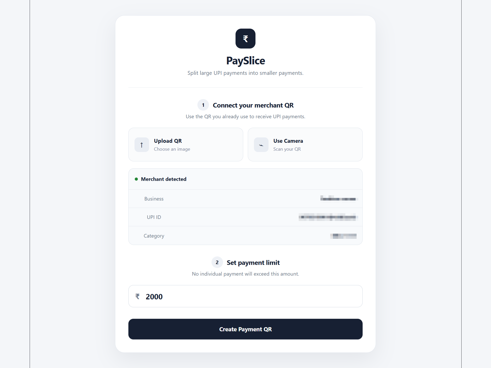
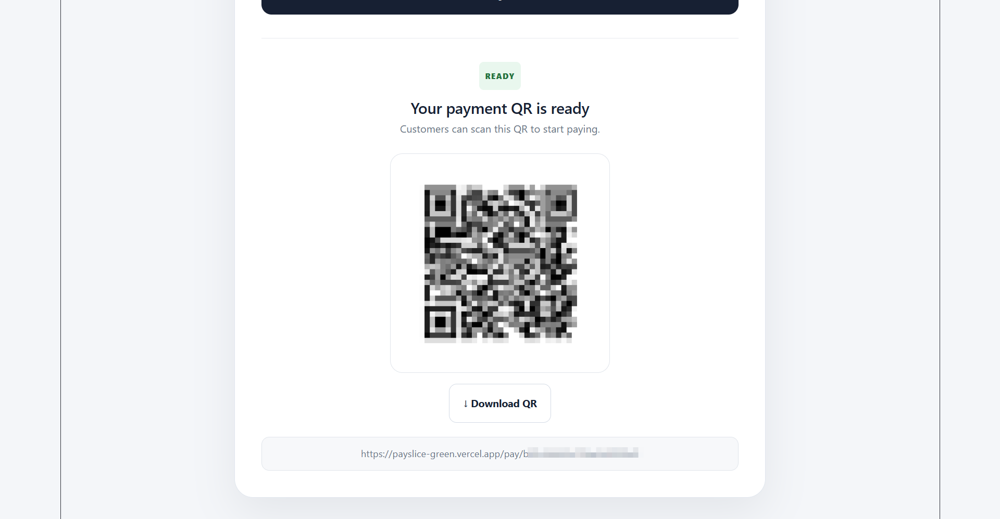
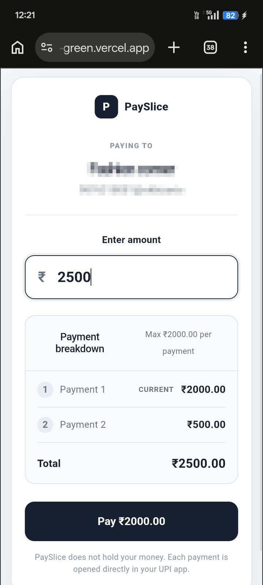
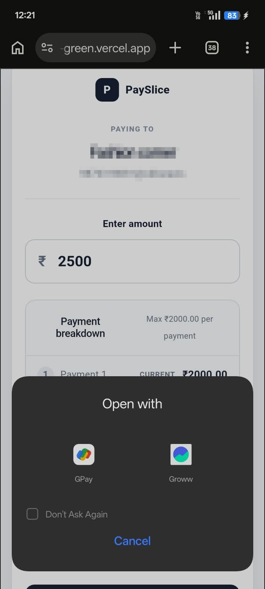
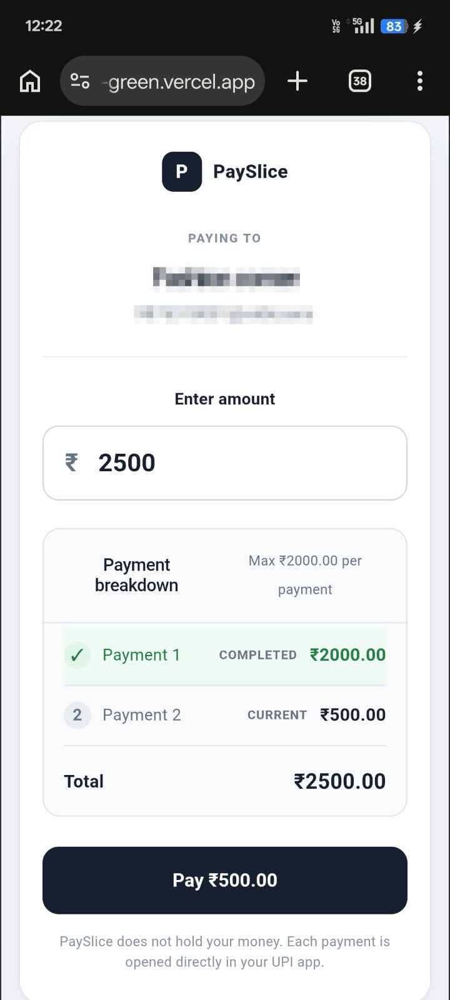
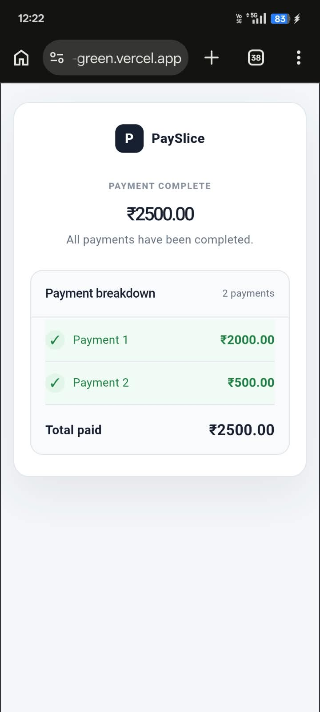

# PaySlice

<p align="center">
  
</p>

<p align="center">
  <a href="https://payslice-green.vercel.app" target="_blank">
    
  </a>
  
  
</p>

> Split a large UPI payment into smaller payments, each within a merchant-defined limit.

PaySlice is a web-based UPI payment splitting prototype that helps merchants define a maximum payment chunk and lets customers split a large amount into multiple smaller UPI payments.

PaySlice does not hold or process money. It generates UPI payment intents that open directly in the customer’s UPI application.

---

## Live Demo

Try the prototype here: [https://payslice-green.vercel.app](https://payslice-green.vercel.app)

---

## Features

### Merchant

- Scan or upload an existing merchant UPI QR
- Automatically extract:
  - Merchant name
  - UPI ID
  - Merchant Category Code (MCC)
- Configure a maximum payment chunk
- Generate a unique PaySlice payment QR
- Download the generated QR as a PNG

### Customer

- Scan the merchant’s PaySlice QR
- View merchant information
- Enter the total payment amount
- Automatically split the amount into smaller chunks
- View the complete payment breakdown
- Open each payment through a UPI intent
- Manually confirm completed payments
- See completed payments marked visually
- Retry an individual payment if required
- View a final completion screen

---

## How It Works

```text
MERCHANT
   │
   ▼
Scan / Upload UPI QR
   │
   ▼
Extract merchant information
   │
   ▼
Set Maximum Chunk
   │
   ▼
Generate unique qrId
   │
   ▼
PaySlice QR
   │
   ▼
CUSTOMER
   │
   ▼
Scan PaySlice QR
   │
   ▼
Fetch merchant configuration
   │
   ▼
Enter payment amount
   │
   ▼
Split into chunks
   │
   ▼
Generate UPI Intent
   │
   ▼
Open UPI application
   │
   ▼
Customer completes payment
   │
   ▼
Customer confirms payment
   │
   ▼
Next chunk
   │
   ▼
All completed
```

---

## Example

Suppose a merchant sets the maximum payment chunk to **₹1,000**.

A customer wants to pay **₹2,500**.

PaySlice calculates:

```text
Total: ₹2,500
Payment 1 → ₹1,000
Payment 2 → ₹1,000
Payment 3 → ₹500
```

Each payment is opened separately through a UPI intent.

The customer can see their progress:

```text
✓ Payment 1    ₹1,000    Completed
✓ Payment 2    ₹1,000    Completed
→ Payment 3      ₹500    Current
```

---

## UPI Intent

For every chunk, PaySlice generates a UPI URI similar to:

```text
upi://pay?pa=<merchant-upi-id>&pn=<merchant-name>&mc=<merchant-mcc>&tr=<unique-transaction-reference>&tn=<payment-description>&am=<amount>&cu=INR
```

The intent is passed to the device’s UPI application.

PaySlice itself does not process or hold the payment.

---

## Demo Walkthrough

The following screenshots show the complete PaySlice flow, from merchant setup to payment completion.

### 1. Merchant Details Detected

The merchant scans or uploads an existing merchant UPI QR. PaySlice extracts the merchant details and allows the merchant to configure the maximum payment chunk.

<p align="center">
  
</p>

### 2. PaySlice QR Generation

After the merchant configuration is submitted, PaySlice generates a unique customer-facing PaySlice QR.

<p align="center">
  
</p>

### 3. Customer Payment Breakdown

The customer enters the total amount, and PaySlice automatically divides it into chunks based on the merchant's configured maximum.

<p align="center">
  
</p>

Example:

```text
Total: ₹2,500
Maximum chunk: ₹1,000

Payment 1 → ₹1,000
Payment 2 → ₹1,000
Payment 3 → ₹500
```

### 4. UPI Intent

When the customer starts a payment, PaySlice invokes a UPI intent. On supported devices, the browser or OS can ask the customer which installed UPI application should handle the payment.

<p align="center">
  
</p>

### 5. Partial Payment Completion

After individual payments are completed and manually confirmed, PaySlice marks the completed chunks and keeps the remaining payment active.

<p align="center">
  
</p>

### 6. Payment Completed

Once every chunk has been completed, PaySlice displays the final completion state.

<p align="center">
  
</p>

---

## Architecture

```text
┌─────────────────────────────────────┐
│             Frontend                │
│                                     │
│         React + Vite                │
│                                     │
│  Merchant UI   Customer UI          │
└─────────────────┬───────────────────┘
                  │
                  │ REST API
                  ▼
┌─────────────────────────────────────┐
│              Backend                │
│                                     │
│         Node.js + Express           │
│                                     │
│       Merchant API                  │
└─────────────────┬───────────────────┘
                  │
                  │ Mongoose
                  ▼
┌─────────────────────────────────────┐
│          MongoDB Atlas              │
│                                     │
│    Merchant Configuration          │
└─────────────────────────────────────┘
                  │
                  │ UPI Intent
                  ▼
            ┌───────────────┐
            │   UPI App     │
            │               │
            │ GPay / PhonePe│
            │ etc.          │
            └───────────────┘
```

---

## Tech Stack

### Frontend

- React
- Vite
- JavaScript
- CSS
- `qrcode.react`
- `jsQR`
- `html5-qrcode`

### Backend

- Node.js
- Express.js
- Mongoose
- MongoDB
- CORS
- dotenv

### Payment

- UPI Deep Links / UPI Intent

---

## Project Structure

```text
PaySlice/
├── client/
│   ├── src/
│   │   ├── App.jsx
│   │   ├── App.css
│   │   ├── CustomerPage.jsx
│   │   └── main.jsx
│   ├── public/
│   ├── index.html
│   ├── package.json
│   └── .env
├── demo/
│   ├── Dashboard.png
│   ├── generatedQr.png
│   ├── paymentbreakdown.jpg
│   ├── upiIntentInvoked.jpg
│   ├── partialcompletion.jpg
│   └── paymentcompleted.jpeg
├── server/
│   ├── config/
│   │   └── db.js
│   ├── models/
│   │   └── Merchant.js
│   ├── routes/
│   │   └── merchantRoutes.js
│   ├── server.js
│   ├── package.json
│   └── .env
├── readme.md
└── .gitignore
```

---

## Merchant Data Model

PaySlice stores merchant configuration in MongoDB.

```text
Merchant
├── qrId
├── merchantName
├── upiId
├── mcc
├── maxChunk
├── active
├── createdAt
└── updatedAt
```

The customer-facing QR contains only the public `qrId`.

The customer uses this ID to retrieve the corresponding merchant configuration from the backend.

---

## Why Store Merchant Configuration?

The PaySlice QR does not directly contain sensitive merchant configuration.

Instead, it contains a URL such as:

```text
https://your-domain.com/pay/<qrId>
```

The backend maps the `qrId` to the merchant configuration.

This means the customer cannot simply modify the URL to change:

```text
UPI ID
Merchant
Maximum chunk
MCC
```

The backend remains the authoritative source for the merchant configuration.

---

## Payment State

PaySlice V1 intentionally does not maintain a transaction ledger.

Payment progress exists only in the customer's current browser session.

For example:

```text
paymentIndex = 0
```

means the first chunk is active.

After confirmation:

```text
paymentIndex = 1
```

and the next chunk becomes active.

This keeps the V1 architecture simple and avoids storing payment history.

---

## Payment Verification

### Current V1

Payment completion is confirmed manually by the customer.

```text
Open UPI
   ↓
Complete payment
   ↓
Return to PaySlice
   ↓
"I completed this payment"
   ↓
Next payment
```

PaySlice does not independently verify whether the payment was actually successful in V1.

### Future

A production implementation could integrate with appropriate payment-provider / PSP APIs to verify payment status independently.

This is intentionally outside the scope of V1.

---

## Security Considerations

PaySlice does not collect or store:

- UPI PINs
- Bank credentials
- Card details
- Payment credentials

Payments are opened through the customer's UPI application.

The backend stores merchant configuration required to generate the payment intent.

The `qrId` is a public identifier, not an authentication credential.

---

## Environment Variables

### Frontend

Create `client/.env`:

```env
VITE_API_URL=http://localhost:5000
```

For production, replace this with the deployed backend URL.

Example:

```env
VITE_API_URL=https://api.example.com
```

### Backend

Create `server/.env`:

```env
MONGODB_URI=your_mongodb_connection_string
PORT=5000
```

Do not commit `.env` files to Git.

---

## Local Setup

### 1. Clone the repository

```bash
git clone <your-repository-url>
cd PaySlice
```

### 2. Install frontend dependencies

```bash
cd client
npm install
```

### 3. Install backend dependencies

Open another terminal:

```bash
cd server
npm install
```

### 4. Configure environment variables

Create:

```text
client/.env
server/.env
```

using the examples above.

### 5. Start the backend

Inside `server/`:

```bash
npm start
```

The backend will run on:

```text
http://localhost:5000
```

### 6. Start the frontend

Inside `client/`:

```bash
npm run dev
```

The frontend will normally run on:

```text
http://localhost:5173
```

---

## Development Flow

### Merchant

1. Open PaySlice.
2. Upload or scan an existing merchant UPI QR.
3. Verify the detected merchant details.
4. Set the maximum payment chunk.
5. Generate the PaySlice QR.
6. Display or download the QR.

### Customer

1. Scan the PaySlice QR.
2. Enter the total amount.
3. Review the payment breakdown.
4. Tap the current payment.
5. Complete the payment in the UPI application.
6. Return to PaySlice.
7. Confirm the payment.
8. Continue with the next chunk.

---

## Current Limitations

PaySlice V1 is a prototype and intentionally has several limitations.

### Manual payment confirmation

The customer manually confirms whether a payment was completed.

### No automatic payment verification

PaySlice does not currently query a bank, PSP, or payment provider to independently verify payment status.

### No transaction history

PaySlice does not maintain a transaction ledger.

### UPI app availability

UPI intents depend on the device and installed UPI applications.

### Browser / device behavior

Returning from a UPI application to the browser can behave differently depending on the operating system, browser, and UPI application.

### Merchant QR compatibility

V1 expects a merchant UPI QR containing the required UPI parameters such as:

```text
pa
pn
mc
```

Different QR formats may require additional handling.

---

## Future Improvements

Potential V2 improvements include:

- Automatic payment verification
- Payment status callbacks
- Better handling of UPI app return flows
- Merchant authentication
- Merchant dashboard
- Payment history
- Expiring payment QR codes
- Better QR compatibility
- Improved error handling
- Analytics
- Production-grade payment infrastructure

These are deliberately outside the V1 scope.

---

## Design Goals

PaySlice was built around a few simple principles:

### Keep the payment flow simple

The customer should only need to:

```text
Scan → Enter amount → Pay → Confirm → Repeat
```

### Do not hold customer money

PaySlice generates UPI intents rather than acting as a payment wallet.

### Keep V1 lightweight

No unnecessary transaction database, authentication system, or complex payment infrastructure.

### Use existing merchant information

Instead of asking merchants to manually enter their UPI details and MCC, PaySlice extracts the information from their existing merchant UPI QR.

---

## Disclaimer

PaySlice is a technical prototype and educational project.

It is not a bank, payment aggregator, payment gateway, or wallet.

The V1 implementation does not independently verify successful payment settlement.

For production use, appropriate payment-provider integrations, security controls, compliance requirements, and regulatory requirements would need to be evaluated and implemented.

---

## Author

**Keshav Garg**

Built as a full-stack engineering project exploring:

- React
- Node.js
- Express
- MongoDB
- QR processing
- UPI intents
- Payment flow design
- Client-side state management
- REST APIs

---

## License

This project is intended for educational and experimental purposes.
